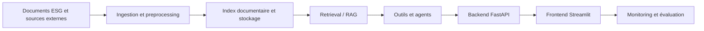

# Architecture V0

> **Avertissement :** cette architecture est provisoire. Elle décrit une direction d'apprentissage, pas un choix définitif de composants ni une implémentation existante.

## Responsabilités des couches

### Documents ESG et sources externes

Regrouper les rapports, publications, référentiels et autres sources autorisées, avec leurs métadonnées et conditions d'utilisation.

### Ingestion et preprocessing

Extraire, nettoyer, normaliser et segmenter les contenus tout en préservant leur provenance et leur structure utile.

### Index documentaire et stockage

Conserver les documents, métadonnées, segments et représentations nécessaires à leur recherche. Les technologies de stockage restent à évaluer.

### Retrieval / RAG

Identifier les éléments pertinents pour une question, construire un contexte contrôlé et produire une réponse reliée à ses preuves, avec des mécanismes d'évaluation.

### Outils et agents

Encapsuler d'éventuelles actions spécialisées et coordonner des recherches multiétapes dans des limites explicites, observables et validées par l'humain.

### Backend FastAPI

Exposer à terme les services applicatifs, contrats d'API, contrôles d'accès et règles d'orchestration. FastAPI est une orientation initiale, non encore implémentée.

### Frontend Streamlit

Fournir à terme une interface de recherche, de consultation des preuves et de validation par l'analyste. Streamlit est une orientation initiale, non encore implémentée.

### Monitoring et évaluation

Mesurer la qualité, la fiabilité, les coûts et le comportement du système, et conserver les traces nécessaires à l'analyse des erreurs. Cette responsabilité devra accompagner toutes les couches lors de leur conception.
